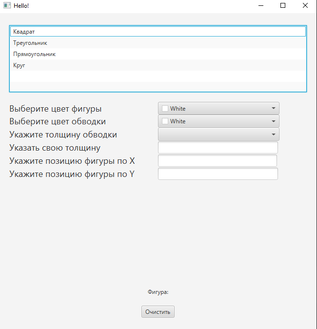
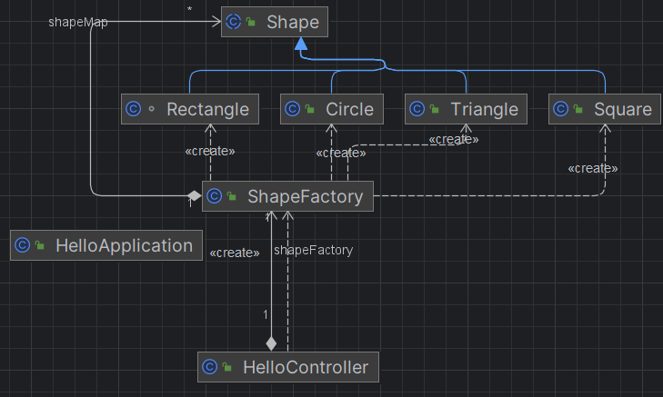

# Shape (рисование фигур)
**Описание:** В данном репозитории представлена программа для рисования фигур.

**Скриншот рабочего окна приложения:**

## Архитектура
**Скриншот диаграммы классов:**

## Зависимости
Язык программироваия **Java**, комплект разработчика приложений **JDK 19**, а также инструментарий GUI **JavaFX**.

## Применение
Для использования данной программы вам необходимо:
* Запустить приложение;
* Выбрать из списка необходимую фигуру;
* Задать цвет фигуры;
* Задать цвет обводки;
* Нажать ЛКМ на поле для рисования;
* Для очистки поля для рисования необходимо нажать на кнопку *Очистить*;
